# Web Scraping / Data Acquisition — Architecture Specification
**Companion to:** `01-data-acquisition-execution-plan.md`. This document goes one level deeper: it is what an engineer (or a coding LLM) should read before writing any code. It contains no implementation code, per the request — only responsibilities, interfaces, data shapes, diagrams, and file-by-file contracts.

Labeling: `PROPOSED ARCHITECTURAL DECISION` = a choice made here that isn't dictated by the brief · `SOURCE-DERIVED` = stated in the brief/plan · `NOT SPECIFIED — REQUIRES DECISION` = genuinely open.

---

## 1. Executive Architecture Summary

This subsystem sits between external sources (CSLB, company websites, CA SOS, and later Google/Yelp/permit portals/FMCSA) and the main acquisition/AI system. It turns raw source data into identifiable entities, evidence-backed claims, timing signals, and contacts — never a bare "good lead" conclusion. It is deliberately small for v0: **three source connectors, one vertical, one geography, no browser automation, no distributed queue.** Every architectural choice below optimizes for that scope while leaving clean seams to grow into the fuller picture the brief describes (more sources, a second vertical, browser automation) without a rewrite.

```
EXTERNAL SOURCES → DATA ACQUISITION SYSTEM (this document) → TRUSTWORTHY STRUCTURED DATA → MAIN ACQUISITION/AI SYSTEM
```

---

## 2. System Boundary

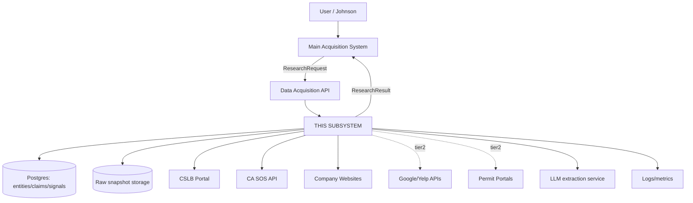

**This subsystem owns:** source connectors, fetching, raw preservation, parsing, extraction (deterministic + LLM), normalization, entity resolution, evidence/claim storage, freshness, signal detection, the `ResearchResult` contract, and its own observability/config/tests.

**This subsystem does NOT own:** the orchestrator/planner, prospect state machine, qualification scoring logic, channel/outreach decisions, message generation and sending, CRM sync, UI, or the general agent framework. It also does not own contact *verification* (deliverability pinging) — it discovers contact points, the main system (or a bought vendor it selects) verifies them. `PROPOSED ARCHITECTURAL DECISION`, confirm with the other developer.

---

## 3. Architectural Principles (applied, not just restated)

- **API-first, scraping last** — enforced structurally: the `SourceConnector` interface (Section 10) has a `source_type` of `api`, `bulk_export`, or `page_fetch`; there is no `browser` type implemented in v0, only reserved.
- **Source-agnostic core** — the pipeline (fetch → parse → extract → normalize → resolve → evidence → signal → publish) never branches on source name. All source-specific behavior lives inside a connector module.
- **Raw preserved forever** — `RawSnapshot` rows are immutable and never deleted; re-processing means re-running parse/extract against existing snapshots, not re-fetching.
- **Observed vs. inferred, always separate rows** — enforced by the `Claim.observed_or_inferred` field being non-nullable and by `Signal`s always carrying an `evidence_ref` back to the observed `Claim` that justified them.
- **Provenance everywhere** — every `Claim` and `Signal` has a `source_snapshot_id`; nothing enters the `Claim` table without one.
- **Freshness is first class** — every `Claim` has `observed_at`/`expires_at`; there is no "just trust the current value" path.
- **Deterministic first** — normalization, deduplication rules, rate limiting, and CSLB/SOS parsing are all deterministic code. LLM use is scoped to exactly one place in v0: extracting fit-evidence snippets from company-website free text (Section 15).
- **Cost/scale awareness** — TTL-based conditional re-fetch (don't re-pull a CSLB export or a company homepage inside its freshness window); no LLM call on structured-source data.
- **Extensibility** — adding source #4 means writing one new connector module + tests, not touching the pipeline core (Section 10, "Add a new source" workflow).

---

## 4. High-Level Architecture

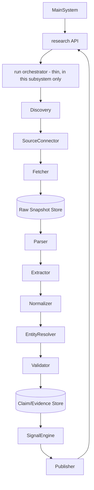

Note: the box labeled "run orchestrator" here is **not** the main system's planner — it is the small internal coordinator that sequences fetch→parse→extract→...→publish for one research request. This is intentionally a thin, deterministic sequencer, not an agent.

---

## 5. Component Architecture

| Component | Responsibility | Does NOT do |
|---|---|---|
| API layer | Accepts `ResearchRequest`, returns `ResearchResult` (sync) or an accepted-job id (async) | No business logic, no parsing |
| Run Coordinator | Sequences the pipeline for one request; tracks per-request state | No qualification/scoring |
| Source Connectors | Source-specific discovery + fetch + raw-schema mapping | No cross-source logic, no entity resolution |
| Fetcher | HTTP GET/POST with rate limiting, retries, conditional requests | No parsing |
| Raw Store | Persist immutable snapshots | No normalization |
| Parser | Turn raw bytes/HTML/JSON into a structured, source-shaped record | No cross-field inference |
| Extractor (deterministic + LLM) | Turn a parsed record into `Claim` candidates | No storage |
| Normalizer | Canonicalize names/addresses/phones/domains | No entity merging |
| Entity Resolver | Match/merge records into canonical `Entity`s | No claim generation |
| Evidence Store | Persist `Claim`s with provenance/freshness | No signal logic |
| Signal Engine | Derive `Signal`s from `Claim`s | No claim generation |
| Publisher | Assemble and return `ResearchResult` | No source fetching |

---

## 6. Repository Structure

```
data-acquisition/
├── src/
│   ├── api/
│   │   ├── research_api.py            # MVP
│   │   └── contracts.py               # MVP — pydantic models for ResearchRequest/Result
│   ├── orchestration/
│   │   └── run_coordinator.py         # MVP
│   ├── sources/
│   │   ├── base.py                    # MVP — SourceConnector protocol + registry
│   │   ├── cslb/
│   │   │   ├── connector.py           # MVP
│   │   │   ├── parser.py              # MVP
│   │   │   └── fixtures/              # MVP — saved sample export pages
│   │   ├── ca_sos/
│   │   │   ├── connector.py           # MVP
│   │   │   └── parser.py              # MVP
│   │   ├── company_site/
│   │   │   ├── connector.py           # MVP
│   │   │   └── parser.py              # MVP
│   │   └── google_places/             # FUTURE (Tier 2)
│   ├── fetch/
│   │   ├── http_fetcher.py            # MVP
│   │   ├── rate_limiter.py            # MVP
│   │   └── browser_fetcher.py         # FUTURE (not built in v0)
│   ├── raw/
│   │   └── snapshot_store.py          # MVP
│   ├── extract/
│   │   ├── deterministic.py           # MVP — CSLB/SOS field mapping
│   │   └── llm_extractor.py           # MVP — narrow, company-site fit evidence only
│   ├── normalize/
│   │   ├── names.py                   # MVP
│   │   ├── addresses.py               # MVP
│   │   ├── phones.py                  # MVP
│   │   └── domains.py                 # MVP
│   ├── entities/
│   │   ├── resolver.py                # MVP — deterministic matching
│   │   └── review_queue.py            # MVP — low-confidence matches
│   ├── evidence/
│   │   ├── claim_store.py             # MVP
│   │   └── freshness.py               # MVP
│   ├── signals/
│   │   ├── rules.py                   # MVP
│   │   └── types.py                   # MVP
│   ├── publish/
│   │   └── result_builder.py          # MVP
│   ├── storage/
│   │   └── db.py                      # MVP — Postgres session/engine
│   ├── config/
│   │   ├── source_policies.py         # MVP
│   │   └── settings.py                # MVP
│   └── observability/
│       └── logging.py                 # MVP
├── tests/
│   ├── unit/
│   ├── integration/
│   ├── fixtures/
│   └── e2e/
├── scripts/
│   └── backfill_cslb_county.py        # MVP
└── docs/
```

---

## 7. Domain Model

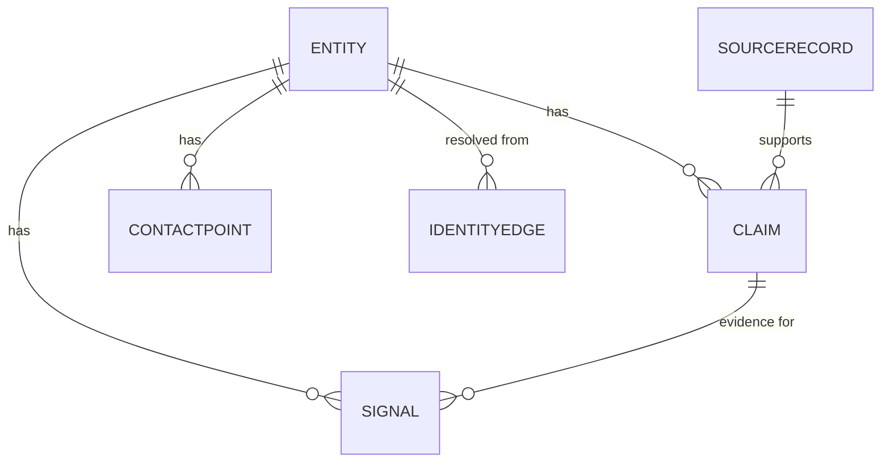

See execution plan Part 7 for field-level detail on `Entity`, `SourceRecord`, `Claim`, `IdentityEdge`, `ContactPoint`, `Signal` — this document does not repeat it, only extends it with the two fields needed for pipeline mechanics:

- `Claim.extractor_version` — string identifier (e.g., `cslb_parser@0.1`), required for every claim, enables reprocessing raw data with a newer extractor without losing the ability to compare outputs.
- `SourceRecord.content_hash` — SHA-256 of raw payload; used for conditional re-fetch decisions and to detect if a "new" fetch actually changed anything.

---

## 8. Source Connector Architecture

**Interface (conceptual, not code):** `SourceConnector` exposes:
- `source_metadata` — name, `source_type` (`api` / `bulk_export` / `page_fetch`), auth requirement, rate-limit policy, terms-of-use notes
- `discover(params) -> list[CandidateRef]` — e.g., "give me the CSLB export URL for classification B, Alameda county"
- `fetch(candidate_ref) -> RawSnapshot` — retrieves and hands off to raw storage
- `parse(raw_snapshot) -> list[ParsedRecord]` — source-shaped, not yet normalized

**Three concrete connectors in v0:**
| Connector | `source_type` | Auth | Notes |
|---|---|---|---|
| `cslb` | `page_fetch` (static export pages) | None | No API exists (execution plan Part 4); must be polite, scheduled, and structure-tested |
| `ca_sos` | `api` | API key (per brief) | Standard JSON API pattern |
| `company_site` | `page_fetch` | None | Small fixed page set per entity, not a crawl |

Adding source #4 (e.g., a permit portal) means: implement `SourceConnector` for it, add fixtures, add contract tests, register it (Section 9) — the pipeline core does not change.

---

## 9. Source Registry

`PROPOSED ARCHITECTURAL DECISION`: a simple in-code registry (a dict/mapping from source name → connector instance, built at startup from `config/source_policies.py`), not a plugin/dynamic-discovery system — three sources doesn't justify plugin infrastructure.

**Add-a-new-source workflow:**
1. Research access method/terms (execution plan Part 4/11 pattern) — do this *before* writing code.
2. Implement `SourceConnector` for it under `src/sources/<name>/`.
3. Add fixture files (a real saved response/page) under `sources/<name>/fixtures/`.
4. Write contract tests (Section 31) against the fixture.
5. Register it in `config/source_policies.py` with its rate limit/auth/TTL policy.
6. Run it against the real source in a staging/manual mode first (not production schedule).
7. Enable it on the schedule; monitor first week closely (Section 28 metrics).

---

## 10. Crawling Architecture

**`NOT SPECIFIED — REQUIRES DECISION` scope note:** v0 does not need a general crawler. "Crawling" here means, for `company_site` only: fetch a small fixed set of likely page paths (`/`, `/about`, `/services`, `/careers`, `/contact`) rather than following arbitrary links. This is a **page-set fetch**, not a frontier-based crawl.

If a future source genuinely requires link-following (e.g., discovering an unknown careers-page URL), add: URL canonicalization, a depth limit of 2, domain-restricted following, and content-type filtering — but do not build this until a real source needs it (Part 14 of the execution plan).

**Page prioritization (company_site):** fixed candidate paths tried in order; each fetched page is scored by simple heuristics (presence of keywords like "hiring," "remodel," "services") to decide which pages feed the LLM extractor, keeping LLM calls to 1–2 pages per entity, not the whole site.

**Execution model:** synchronous-per-entity, called from the Run Coordinator; no queue needed at v0 volume (see Section 23 for when that changes).

---

## 11. Fetching Architecture

- **HTTP fetcher only in v0.** No browser fetcher is implemented; `browser_fetcher.py` exists as a stub/interface placeholder for future use (execution plan explicitly excludes browser automation from v0).
- **HTTP fetcher responsibilities:** issue request with per-source headers/timeouts, respect `robots.txt` for `page_fetch` sources, apply the rate limiter, retry on 5xx/timeout with exponential backoff (max 3 attempts), do NOT retry on 403/429 beyond a single backoff — treat repeated 403 as a policy signal, not a transient fault, and escalate to dead-letter.
- **Conditional requests:** for `api`/`bulk_export` sources that support it, use ETags/If-Modified-Since; for `page_fetch` sources (CSLB, company sites) compare `content_hash` after fetch and skip downstream reprocessing if unchanged.
- **When browser fetching would be triggered (future):** only if a specific Tier-2 source is confirmed to have no API/export and to require JS rendering — decided per-source, never as a default fallback.

---

## 12. Parsing Architecture

| Source | Raw format | Parser responsibility |
|---|---|---|
| CSLB | HTML table / CSV export | Row → column mapping into a `ParsedCSLBRecord` (license #, name, classification, status, address, county, phone, bond, workers' comp) |
| CA SOS | JSON | Field mapping into `ParsedSOSRecord` |
| Company site | HTML | DOM parse for visible text + contact block (phone/email patterns, address); no JSON-LD assumed present, but extract it opportunistically if found |

Parsers never infer — they map source structure to a source-shaped record 1:1. Semantic interpretation (e.g., "does this page describe remodeling services") belongs to the Extractor (Section 8/15), not the Parser.

---

## 13. Extraction Architecture

- **Deterministic extraction** (CSLB, CA SOS → `Claim`): direct field mapping, e.g., `ParsedCSLBRecord.status` → `Claim(field="license_status", value=..., observed_or_inferred="observed", confidence=0.95)`. Confidence is fixed per field type for structured sources — not learned or LLM-estimated.
- **LLM extraction** (company site free text → `Claim`/candidate signal): see Section 15.
- **Boundary:** the Extractor never touches the network or the database directly — it takes a `ParsedRecord` in, returns `Claim` candidates out; persistence happens in the Evidence Store (Section 18).

---

## 14. Normalization Architecture

| Field | Canonicalization rule |
|---|---|
| Company name | Strip legal suffixes (Inc/LLC/Corp), lowercase, collapse whitespace, keep original alongside normalized form |
| Address | Split into street/city/county/state/zip; do not geocode in v0 |
| Phone | E.164-style digits-only normalized form, keep original formatting alongside |
| Domain | Lowercase, strip `www.`/protocol, keep as the join key for entity resolution |
| Dates | ISO 8601 |

**Ambiguity handling:** if normalization can't confidently resolve a field (e.g., an address missing a component), store the raw value and flag `normalization_status = partial` rather than guessing — downstream entity resolution treats partial-normalized fields as lower-confidence matching signals.

---

## 15. LLM Extraction Architecture

**Scope in v0, deliberately narrow:** exactly one extraction task — given a company-site page's visible text, extract 0–2 short evidence snippets relevant to "does this company do remodeling work" and "is there a hiring/expansion signal," each tied to a verbatim quote from the page.

- **Input:** page text (already parsed/cleaned), plus the fixed instruction/schema.
- **Output schema:** a list of `{claim_or_signal_candidate, supporting_quote, page_url}` — the supporting quote is mandatory; an extraction with no quote is rejected before it ever becomes a `Claim`.
- **Validation:** the supporting quote must actually appear (substring match, allowing for whitespace normalization) in the source page text — this is the hallucination check. Failing this check drops the candidate and logs it; it never silently becomes a `Claim`.
- **Model/version recorded:** every LLM-derived `Claim`'s `extractor_version` includes the model identifier and prompt-version string.
- **Failure handling:** LLM call failure or malformed output → the candidate is dropped for this run; the page's deterministic facts (if any) still flow through. No fallback "guess" is generated.
- **Replay:** because raw pages are preserved (Section 6, `raw/snapshot_store.py`), re-running extraction with a new prompt/model version against old snapshots is a first-class operation (a script, not a special pipeline mode).
- **The raw source remains the source of truth** — an LLM-derived `Claim` is marked `observed_or_inferred = observed` only for the literal quoted fact ("the page says X"); any semantic interpretation beyond the quote (e.g., "this suggests expansion") is a separate `Signal` marked `inferred`.

---

## 16. Entity Resolution Architecture

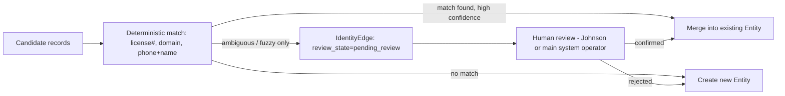

- **Candidate generation:** within one research run, only records touching the same requested entity are compared — no global cross-run entity matching in v0.
- **Deterministic matching, in priority order:** exact CSLB license number → normalized domain → normalized phone + name-similarity above a fixed threshold.
- **Fuzzy matching:** name-similarity only, as a fallback; always produces a `pending_review` edge, never an auto-merge.
- **Canonical entity creation:** the first record establishes the canonical `Entity` row; subsequent matched records attach `Claim`s to it rather than creating a new row.
- **Future records attaching:** a later research run re-derives candidate matches the same way; there is no persistent global entity-matching index in v0 (see Section 38, Future).

---

## 17. Evidence & Claim Architecture

Lifecycle: `SOURCE → RAW SNAPSHOT → EXTRACTED FACT (candidate) → NORMALIZED CLAIM (persisted) → EVIDENCE (claim + its source chain, as consumed downstream) → ENTITY`.

**Conflict handling (Source A says X, Source B says Y):** `PROPOSED ARCHITECTURAL DECISION` — v0 does **not** attempt automatic conflict resolution. Both claims are stored, both visible in the `ResearchResult`, with their respective confidence/freshness/source. Source precedence (e.g., "CSLB license_status always wins over a company-site claim about license status") is expressed as a simple static precedence table per field, used only for *display ordering*, not for deleting the losing claim. This avoids building a contradiction-resolution engine before real contradictions are observed.

---

## 18. Freshness Architecture

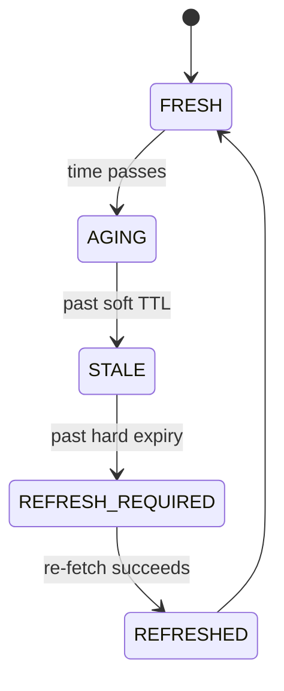

| Field type | Suggested TTL | Rationale |
|---|---|---|
| CSLB license status | 30 days | Portal itself is near-real-time but a monthly re-check is proportionate for a pilot |
| Company site fit-evidence | 30 days | Pages don't change often |
| Signals (careers post, etc.) | 14 days | Timing evidence decays faster |
| CA SOS registration status | 90 days | Rarely changes once formed |

`PROPOSED ARCHITECTURAL DECISION` — these are starting values, not measured; revisit after Phase 5 evaluation (execution plan Part 18). Refresh is triggered by a scheduled job checking `expires_at`, not by request-time lazy refresh, to keep request latency predictable.

---

## 19. Signal Architecture

`Signal` (type, evidence_ref, confidence, observed_or_inferred, expires_at, entity_relationship) is generated by a small rule engine (`signals/rules.py`) that pattern-matches on recent `Claim`s — e.g., "a `license_status` claim transitioned from non-active to active within the last N days" → `Signal(type=license_renewed)`. Rules are deterministic and unit-testable against fixture claim sequences; no ML ranking of signals in v0.

---

## 20. Contact Architecture

**Contact discovery** (this subsystem): extract published phone/email/contact-form URL from CSLB records and company-site contact blocks; store as `ContactPoint` with `verification_state = unverified`.
**Contact verification** (explicitly NOT this subsystem, `PROPOSED ARCHITECTURAL DECISION` pending confirmation): deliverability checks, mailbox pings, and any purchased enrichment belong to the main system or a vendor it selects. This subsystem never marks a `ContactPoint` as verified on its own.

---

## 21. Storage Architecture

| Store | Contents | Why |
|---|---|---|
| PostgreSQL | `Entity`, `SourceRecord` (metadata only), `Claim`, `IdentityEdge`, `ContactPoint`, `Signal` | Relational fit, needs joins/queries for entity resolution and freshness sweeps |
| Raw/object storage (local disk or S3-compatible bucket) | Raw payload bytes referenced by `SourceRecord.raw_payload_ref` | Keep large/unstructured raw HTML out of the relational DB row size, but still durable and immutable |
| In-DB TTL columns | `expires_at` on `Claim`/`Signal` | No separate cache layer needed at this scale |
| Simple job table | pending/in-progress/done/dead-letter fetch+parse+extract jobs | Replaces a message queue for v0 volume |

No search index, no vector DB — nothing in the MVP requires semantic search over entities.

---

## 22. Queue / Async Architecture

`PROPOSED ARCHITECTURAL DECISION`: a **DB-backed job table**, not Celery/RabbitMQ/SQS, given three sources and a single-pilot volume. Columns: `job_id, job_type, payload, status, attempts, last_error, created_at, updated_at`. A scheduler (cron/APScheduler) enqueues CSLB pulls weekly and company-site fetches per new candidate; a worker loop polls the table.

- **Idempotency:** job payload includes a deterministic key (e.g., `cslb:county:classification:week`) so re-enqueueing the same logical job doesn't duplicate work.
- **Dead-letter:** `status = dead_letter` after 3 failed attempts, with `last_error` populated; a dead-lettered job requires human action, it is never silently retried forever.
- **When to graduate to a real queue:** once concurrency needs exceed what a single polling worker can handle, or once more than ~5 source connectors run on independent schedules — not before.

---

## 23. State Machines

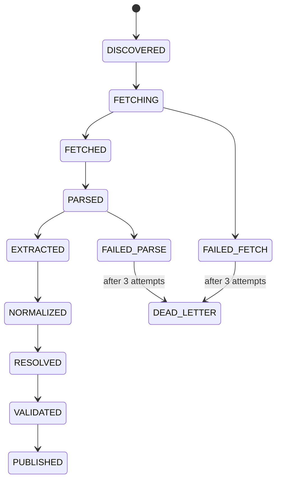
Terminal failure state is `DEAD_LETTER`; terminal success state is `PUBLISHED`. This state lives per-job (Section 22 job table), not per-entity — an `Entity` can accumulate `Claim`s from many independently-progressing jobs.

---

## 24. Error Architecture

| Error category | Retryable? | Dead-letter? | Alert? |
|---|---|---|---|
| `SourceUnavailable` (5xx, timeout) | Yes (backoff, 3x) | After 3 | No, unless repeated across a whole source |
| `AuthenticationFailure` | No | Immediately | Yes |
| `RateLimited` (429) | Yes, with longer backoff | After extended retries | If persistent |
| `SchemaChanged` (CSLB structure test fails) | No | Immediately | **Yes, always** — this is the highest-priority alert in the whole system |
| `ParsingFailure` | No (structural, not transient) | Immediately | Yes |
| `ExtractionFailure` (LLM call/validation failure) | No | Immediately, entity still gets its deterministic claims | No, unless rate is high |
| `EntityResolutionAmbiguous` | N/A | Goes to `pending_review`, not dead-letter | No |
| `PolicyViolation` (robots disallow, ToS conflict) | No | Immediately | Yes — this should stop the connector, not just the job |

---

## 25. Configuration Architecture

`config/source_policies.py` holds, per source: rate limit, auth requirement, TTL per field type, allowed page paths (for `company_site`), retry policy. `config/settings.py` holds environment-level config (DB URL, storage bucket, LLM API access). Credentials are never hardcoded in connector modules — always read from environment/secret store via `settings.py`.

---

## 26. Security Architecture

- **Credentials:** CA SOS API key and LLM API key are the only secrets in v0; both loaded from environment variables / secret manager, never committed, never logged.
- **No customer-authorized browser credentials in v0** — that entire concern (from the brief's freight/vertical-system discussion) is out of scope until browser automation is actually built.
- **Data sensitivity:** all v0 data is public-record business information; no personal/consumer data is collected. If Tier 2 sources (job postings, permit portals with owner names) are added later, revisit this section.

---

## 27. Observability

**Metrics to emit from v0:** fetch attempts/successes/failures per source, parse failures, extraction failures (LLM), claims generated per source, signals generated, entities created vs. merged, dead-letter count, job queue depth, LLM calls + approximate cost per run.
**Logs:** structured, one line per pipeline stage transition, including `job_id` and `source` for correlation.
**No tracing/APM stack in v0** — three sources and low volume don't justify it; structured logs + counters are sufficient to debug.

---

## 28. Data Quality

Dimensions tracked (not collapsed into one score): identity confidence (entity resolution match strength), fit evidence presence, timing evidence presence/age, freshness (% of claims within TTL), provenance (has `source_snapshot_id`), duplicate status. Hard failures (e.g., a `Claim` with no source) block publish; everything else is a visible quality field on the `ResearchResult`, not a hidden gate.

---

## 29. Testing Architecture

- **Unit tests:** normalizers, entity-matching rules, signal rules — pure functions, no network.
- **Integration tests:** connector → parser against saved fixtures (not live network calls in CI).
- **Source contract tests (Section 31):** the highest-priority test category given CSLB has no API.
- **Pipeline tests:** fixture raw snapshot → full pipeline → assert expected `Claim`/`Signal`/`Entity` output.
- **E2E test:** one real (rate-limited, infrequent) live pull against CSLB, run manually or on a slow schedule, not in every CI run.

---

## 30. Source Contract Testing

For CSLB specifically (no API, so no versioned contract to rely on): store a real fixture export page; a test asserts the parser produces the expected column set and row count from that fixture. **Separately**, a low-frequency live check (e.g., weekly) fetches a real page and asserts its structure still matches the fixture's shape (same columns present) — this is what catches "CSLB changed their export format" before it silently breaks the pipeline. This is the single most important test in the whole system, called out explicitly because CSLB is the one Tier-1 source with no formal API contract.

---

## 31. New Source Onboarding

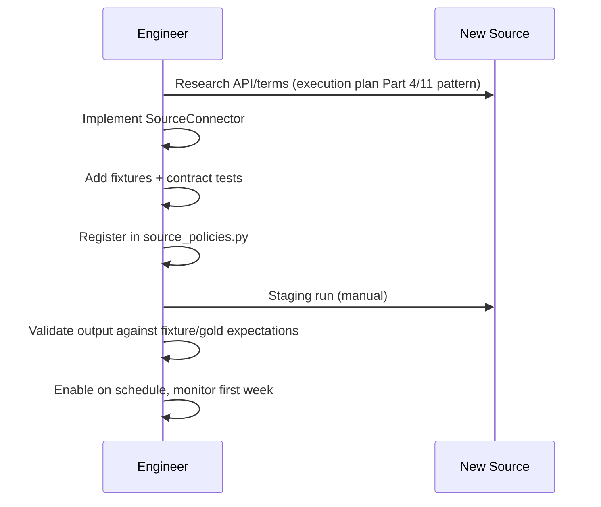

---

## 32. New Vertical Onboarding

**What belongs in core:** the pipeline stages, the `Entity`/`Claim`/`Signal` data model, the `ResearchResult` contract.
**What belongs in a vertical pack (not built yet — freight is the Day-6 test):** which source connectors are relevant, which fields count as "fit," which signal rules apply, vertical-specific normalization (e.g., DOT numbers instead of license numbers).
**What belongs in a source connector:** everything specific to fetching/parsing that one source, independent of vertical.

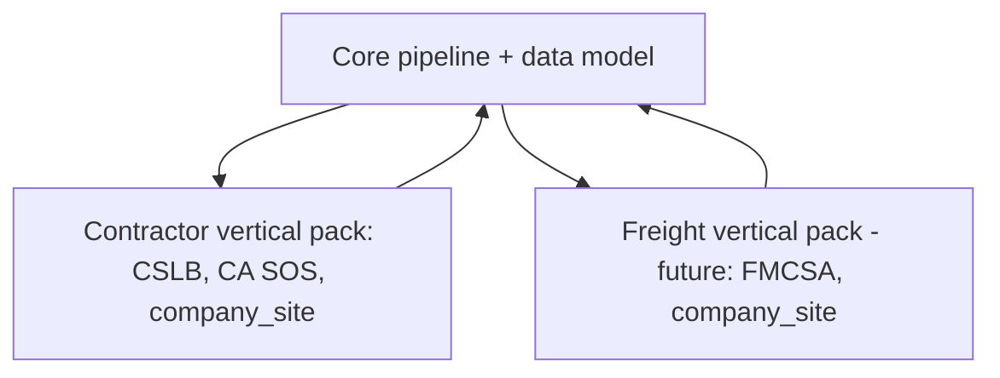
The freight pilot's success criterion (per the brief) is literally how little this diagram needs to change.

---

## 33. Main System Integration

**`ResearchRequest`:**
```json
{"request_id": "string", "entity_hint": {"name": "string", "domain": "string|null"}, "questions": ["license_status", "..."]}
```
**`ResearchResult`:** entity + claims[] + signals[] + contacts[] + sources[] (full shape in execution plan Appendix A).

- **Lifecycle:** v0 is synchronous request→response for a single entity; async/batch is `NOT SPECIFIED — REQUIRES DECISION` pending the other developer's needs.
- **Correlation/idempotency:** `request_id` is caller-supplied and echoed back; re-submitting the same `request_id` returns the cached result if still fresh rather than re-running the pipeline.
- **Versioning:** contract carries a `schema_version` field from day one, even though it's `"1"` for a while.
- **Error responses:** a structured `{error_code, message, request_id}` — never a silent empty result.

---

## 34. MCP / Tool Interface

`NOT SPECIFIED — REQUIRES DECISION`: whether the main system consumes this subsystem via a plain REST API or wants MCP tool calls (`research_entity`, `get_evidence`, `get_signals`, `find_contacts`, `refresh_entity`). `PROPOSED ARCHITECTURAL DECISION`: expose the same underlying functions behind both a REST endpoint and, if the main system is MCP-based, a thin MCP tool wrapper — the wrapper contains no logic, it only translates tool calls into the same `ResearchRequest`/`ResearchResult` contract. This keeps source-specific logic out of the tool layer entirely, per the brief's explicit requirement.

---

## 35. Cost Control

- Conditional/TTL-based re-fetch (Section 11/18) avoids redundant HTTP calls.
- LLM extraction scoped to 1–2 pages per entity, only for `company_site` (Section 15) — never called against CSLB/SOS structured data.
- Weekly (not per-request) CSLB pulls, cached and reused across all requests touching that county+classification within the freshness window.
- No repeated re-crawling of the same company site within its TTL, even across different research requests.

---

## 36. Implementation Order

| Phase | Files | Definition of done |
|---|---|---|
| 1 — Foundation | `storage/db.py`, `config/*`, data model tables | Schema migrated, empty tables exist |
| 2 — Connector framework | `sources/base.py` | `SourceConnector` protocol defined, one fake/test connector passes |
| 3 — First source (CSLB) | `sources/cslb/*`, `fetch/*`, `raw/snapshot_store.py` | Real CSLB fixture parses correctly |
| 4 — Extraction/normalization | `extract/deterministic.py`, `normalize/*` | CSLB record → normalized `Claim` candidates |
| 5 — Evidence storage | `evidence/claim_store.py`, `evidence/freshness.py` | Claims persisted with provenance/TTL |
| 6 — Entity resolution | `entities/*` | Deterministic matching produces correct `Entity` rows on fixture data |
| 7 — Second/third source (CA SOS, company_site) | `sources/ca_sos/*`, `sources/company_site/*`, `extract/llm_extractor.py` | Multi-source claims attach to the same entity |
| 8 — Signals | `signals/*` | At least one signal type fires on fixture data |
| 9 — Publish/API | `publish/result_builder.py`, `api/*` | Real `ResearchResult` returned for a test request |
| 10 — Observability/quality | `observability/logging.py`, quality metrics | Metrics visible; Section 30 contract test running |

---

## 37. MVP vs. Future

| Component | MVP | Future |
|---|---|---|
| Browser fetcher | Not built | Only if a specific Tier-2 source needs it |
| Queue | DB-backed job table | Real message queue if concurrency grows |
| Entity resolution | Deterministic rules | Fuzzy/ML matching if measured error rate justifies it |
| Vertical packs | Contractor only, freight as a config test | Formal pack plugin system, once ≥2 packs exist and share is measured |
| Contact verification | Not built (main system's job) | N/A for this subsystem |
| MCP interface | Optional thin wrapper | Full tool surface if main system is MCP-native |

---

## 38. Anti-Patterns (explicitly avoided here)

- **One giant scraper class** — avoided by the `SourceConnector` interface; each source is its own module.
- **Source-specific logic in the core pipeline** — avoided; the Run Coordinator only calls the interface, never checks `if source == "cslb"`.
- **LLM as source of truth** — avoided; LLM output requires a verbatim quote match against raw text before becoming a claim.
- **No raw snapshots** — avoided; raw storage is immutable and required before any parsing happens.
- **No freshness** — avoided; every claim/signal has TTL fields from the schema's first version.
- **Scraping synchronously inside API requests** — avoided for CSLB (scheduled, cached); company-site fetch per-request is accepted at v0 volume but flagged here as the one place to revisit if request volume grows.
- **Hardcoded credentials** — avoided; all secrets via `settings.py`/environment.
- **Coupling vertical logic to source logic** — avoided per Section 32's explicit boundary.

---

## 39. File Dependency Graph

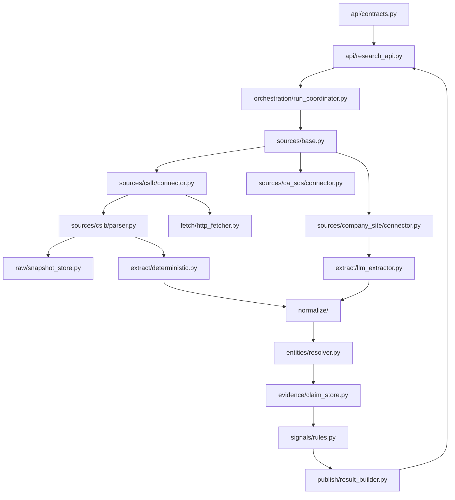
No circular dependencies: `sources/*` never imports from `entities/`, `evidence/`, or `publish/`; `extract/` never imports from `entities/`; `entities/` never imports from `sources/` or `fetch/`.

---

## 40. Request Lifecycle (sequence)

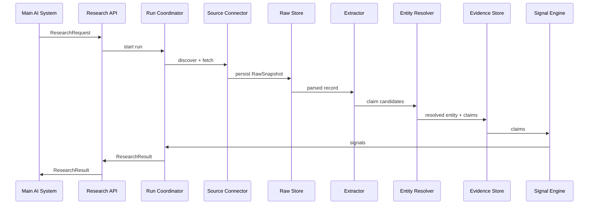
v0 is synchronous end-to-end for a single entity; the "async boundary" is only the weekly CSLB refresh job, which runs independently of any single request.

---

## 41. Failure Lifecycle

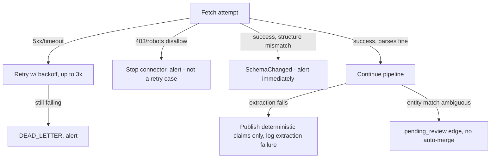

---

## 42. Complete File-by-File Specifications

Full template applied to the foundational/highest-risk files below. Remaining files (additional source connectors, additional normalizers) follow the same template pattern demonstrated here and should be written to this same level of detail as each is actually built (Section 44 lists every file that should eventually exist).

---
### FILE: `src/sources/base.py`
**PURPOSE:** Defines the `SourceConnector` protocol and the source registry. Nothing source-specific lives here.
**RESPONSIBILITIES:** Declare the interface (`discover`, `fetch`, `parse`, `source_metadata`); provide the registry lookup used by the Run Coordinator.
**NON-RESPONSIBILITIES:** No HTTP calls, no parsing logic, no persistence.
**DEPENDENCIES:** internal — none below it; external — `pydantic` (for metadata typing).
**INPUTS:** none (defines types/interfaces only).
**OUTPUTS:** the protocol definitions consumed by every connector module.
**KEY TYPES/INTERFACES:** `SourceConnector` protocol; `SourceMetadata` (name, source_type, auth_required, rate_limit_policy); `CandidateRef` (opaque per-source discovery result).
**KEY FUNCTIONS:** `register_connector(name, connector)`; `get_connector(name) -> SourceConnector`. No bodies given.
**STATE:** holds the in-memory registry dict, populated at process startup from `config/source_policies.py`.
**ERROR HANDLING:** `get_connector` on an unknown name raises a clear `UnknownSourceError`; no silent None return.
**OBSERVABILITY:** none directly; connectors built from this registry are what gets instrumented.
**CONFIGURATION:** none directly.
**SECURITY:** none directly.
**TESTING REQUIREMENTS:** unit test that registration/lookup works and that an unknown source raises.
**DEPENDENTS:** every `sources/<name>/connector.py`, `orchestration/run_coordinator.py`.
**IMPLEMENTATION NOTES:** keep this file deliberately tiny — it is a seam, not a framework. Resist adding plugin-discovery/auto-registration machinery for three sources.

---
### FILE: `src/sources/cslb/connector.py`
**PURPOSE:** Implements `SourceConnector` for the CSLB Public Data Portal.
**RESPONSIBILITIES:** Build the correct portal export URL/query for a given classification+county; drive the fetch; hand raw bytes to raw storage; call the CSLB parser.
**NON-RESPONSIBILITIES:** No normalization, no entity resolution, no claim generation.
**DEPENDENCIES:** internal — `fetch/http_fetcher.py`, `raw/snapshot_store.py`, `sources/cslb/parser.py`; external — none beyond the HTTP client.
**INPUTS:** `(classification, county)` discovery params.
**OUTPUTS:** `RawSnapshot` (persisted) and `list[ParsedCSLBRecord]`.
**KEY TYPES/INTERFACES:** `ParsedCSLBRecord` (license_number, business_name, classification, status, address, county, phone, bond_info, wc_info).
**KEY FUNCTIONS:** `discover(classification, county) -> CandidateRef`; `fetch(candidate_ref) -> RawSnapshot`; `parse(raw_snapshot) -> list[ParsedCSLBRecord]`. Fetch is idempotent given the same candidate_ref within the TTL window (returns cached snapshot rather than re-fetching); retry behavior per Section 24.
**STATE:** none held in the connector itself; relies on `snapshot_store` for persisted state.
**ERROR HANDLING:** distinguishes `SourceUnavailable` (retry), `SchemaChanged` (no retry, alert — Section 30), `PolicyViolation` (robots disallow — stop, alert).
**OBSERVABILITY:** logs classification/county on every call; emits fetch-success/failure counters tagged `source=cslb`.
**CONFIGURATION:** portal base URL, per-classification/county page-path templates, polite request delay, from `config/source_policies.py`.
**SECURITY:** no credentials (portal is unauthenticated); still respects rate limits as a courtesy/ToS matter.
**TESTING REQUIREMENTS:** contract test against a saved real fixture page (Section 30); unit test for URL-building logic; failure-path test for a deliberately malformed fixture (simulating a structure change).
**DEPENDENTS:** `orchestration/run_coordinator.py` (via the registry), `scripts/backfill_cslb_county.py`.
**IMPLEMENTATION NOTES FOR FUTURE CODING LLM:** the CSLB portal has no documented API contract — treat its page structure as fragile by construction. Every parse must be checked against the fixture-based contract test before being trusted. Do not add speculative fields beyond what the real downloaded export actually contains (execution plan Part 20, step 2) — verify against a real file, don't assume from the brief's field list alone.

---
### FILE: `src/sources/cslb/parser.py`
**PURPOSE:** Converts raw CSLB export HTML/CSV bytes into `ParsedCSLBRecord` rows.
**RESPONSIBILITIES:** Locate the data table/rows in the export format; map columns to fields; handle missing/blank fields explicitly (empty string vs. field absent).
**NON-RESPONSIBILITIES:** No normalization (that's `normalize/`), no claim confidence assignment (that's `extract/deterministic.py`).
**DEPENDENCIES:** internal — none; external — an HTML parsing library.
**INPUTS:** raw bytes/text of one export page.
**OUTPUTS:** `list[ParsedCSLBRecord]`.
**KEY FUNCTIONS:** `parse(raw_text) -> list[ParsedCSLBRecord]`; raises `SchemaChanged` if the expected table/column structure isn't found, rather than returning a partial/empty list silently.
**STATE:** stateless.
**ERROR HANDLING:** any structural mismatch is a hard failure (Section 24: `SchemaChanged`, no retry, immediate alert), never a best-effort partial parse that could silently drop rows.
**OBSERVABILITY:** logs row count parsed per call; a sudden drop to zero or a big deviation from the historical average for that classification+county is itself a signal worth alerting on.
**CONFIGURATION:** none beyond expected-column definitions (versioned alongside the parser).
**SECURITY:** none.
**TESTING REQUIREMENTS:** the primary home of Section 30's contract tests — one fixture-based test per known export variant encountered.
**DEPENDENTS:** `sources/cslb/connector.py`.
**IMPLEMENTATION NOTES:** this is the single highest-maintenance file in the repository given CSLB's lack of an API; write it defensively and keep its contract test suite growing as real edge cases are found.

---
### FILE: `src/extract/llm_extractor.py`
**PURPOSE:** The one LLM-touching file in v0. Extracts fit-evidence/signal-candidate snippets from company-site page text.
**RESPONSIBILITIES:** Build the extraction prompt/schema call; validate the quote-match requirement (Section 15); attach model/prompt version to output.
**NON-RESPONSIBILITIES:** No claim persistence, no confidence scoring beyond pass/fail on the quote check, no use on any structured (CSLB/SOS) source.
**DEPENDENCIES:** internal — none; external — the LLM API client (provider `NOT SPECIFIED — REQUIRES DECISION`, confirm with Johnson/other developer whether this calls the main system's model access or a separate key).
**INPUTS:** cleaned page text + page URL.
**OUTPUTS:** `list[ExtractionCandidate]` (claim_or_signal_type, supporting_quote, page_url, model_version, prompt_version) — only those that pass the quote-match check.
**KEY FUNCTIONS:** `extract(page_text, page_url) -> list[ExtractionCandidate]`; internally calls the model, then validates every returned quote against `page_text` before returning it.
**STATE:** stateless per call.
**ERROR HANDLING:** malformed model output or a failed quote-match silently drops that one candidate (logged), never raises up to fail the whole entity's research.
**OBSERVABILITY:** logs candidates-returned vs. candidates-passed-validation ratio — a low pass rate is a prompt-quality signal worth watching.
**CONFIGURATION:** prompt template version, model identifier, max pages per entity (1–2), from settings.
**SECURITY:** LLM API key via `settings.py`, never logged; page text sent to the model is public company-website content, not sensitive data.
**TESTING REQUIREMENTS:** unit tests with a mocked model response, covering: valid quote (passes), fabricated quote not in source text (rejected), malformed JSON (rejected gracefully).
**DEPENDENTS:** `sources/company_site/connector.py` (calls it after parsing).
**IMPLEMENTATION NOTES:** this file is the one place in the system where hallucination risk is real — the quote-match validation is not optional and must run on every candidate before it reaches `normalize/`.

---
### FILE: `src/entities/resolver.py`
**PURPOSE:** Deterministic entity resolution for one research run's candidate records.
**RESPONSIBILITIES:** Apply the match priority order (license# → domain → phone+name); create `Entity`/`IdentityEdge` rows; route ambiguous matches to review.
**NON-RESPONSIBILITIES:** No claim generation, no fuzzy/ML matching beyond the single name-similarity fallback, no cross-run global matching in v0.
**DEPENDENCIES:** internal — `normalize/*` (for comparing normalized fields), `evidence/claim_store.py` (to attach claims to the resolved entity); external — a string-similarity library for the fuzzy fallback only.
**INPUTS:** normalized candidate records from multiple sources for one run.
**OUTPUTS:** one `Entity` (existing or new) + `IdentityEdge` rows (confidence, review_state) for any fuzzy-only matches.
**KEY FUNCTIONS:** `resolve(candidates: list[NormalizedRecord]) -> Entity`; internally tries deterministic rules in order before falling back to fuzzy, and never auto-merges on fuzzy alone.
**STATE:** none held beyond the DB; each call is independent.
**ERROR HANDLING:** an unresolvable candidate (no match, deterministic new-entity path) is not an error — it's the expected "new entity" case. A fuzzy match below threshold does not error; it creates a `pending_review` edge.
**OBSERVABILITY:** counters for merges-by-rule-type (license#, domain, phone+name, fuzzy-review) — this is what tells you later whether the deterministic rules are actually catching most real matches or whether fuzzy/review volume is too high.
**CONFIGURATION:** fuzzy-match similarity threshold, from settings (tunable without code change).
**SECURITY:** none beyond standard DB access.
**TESTING REQUIREMENTS:** unit tests for each match-priority rule independently, plus a test that two records with only a fuzzy-name match produce a `pending_review` edge, not an auto-merge.
**DEPENDENTS:** `orchestration/run_coordinator.py`.
**IMPLEMENTATION NOTES:** do not add a scored/weighted multi-feature matcher for v0 — the brief and execution plan are explicit that this should stay simple until false-merge/split rates are actually measured against Johnson's gold set.

---
### FILE: `src/evidence/claim_store.py`
**PURPOSE:** Persists `Claim` rows with full provenance and freshness fields; the only write path into the `Claim` table.
**RESPONSIBILITIES:** Enforce that every `Claim` has a non-null `source_snapshot_id`, `observed_or_inferred`, `observed_at`, `expires_at`, `extractor_version` before persisting; provide read paths for freshness sweeps and result-building.
**NON-RESPONSIBILITIES:** No extraction, no normalization, no entity resolution.
**DEPENDENCIES:** internal — `storage/db.py`; external — none beyond the DB driver/ORM.
**INPUTS:** `Claim` candidates (already normalized, already attached to a resolved `Entity`).
**OUTPUTS:** persisted `Claim` rows; query results for `get_claims(entity_id)`, `get_stale_claims(as_of)`.
**KEY FUNCTIONS:** `save_claim(claim) -> ClaimId` (rejects incomplete claims rather than saving nulls); `get_claims(entity_id) -> list[Claim]`; `get_stale_claims(as_of) -> list[Claim]` (feeds the freshness refresh scheduler).
**STATE:** none beyond the DB itself.
**ERROR HANDLING:** a `Claim` missing required provenance fields raises `IncompleteClaimError` at save time — this is the structural enforcement point for the evidence-first principle (Section 3), not just a convention.
**OBSERVABILITY:** counts of claims saved per source per run; count of rejected/incomplete claim attempts (should be zero in steady state — any nonzero value indicates an upstream bug).
**CONFIGURATION:** none beyond DB connection (via `storage/db.py`).
**SECURITY:** standard DB access controls; no PII in v0 data.
**TESTING REQUIREMENTS:** unit test that an incomplete claim is rejected; integration test that a full round-trip (save → get_claims) returns the expected fields including provenance.
**DEPENDENTS:** `entities/resolver.py`, `signals/rules.py`, `publish/result_builder.py`, the freshness scheduler.
**IMPLEMENTATION NOTES:** this file is the structural guarantor of "never silently turn inference into fact" — the rejection of incomplete claims should be treated as a load-bearing invariant, not a nice-to-have validation.

---
### FILE: `src/publish/result_builder.py`
**PURPOSE:** Assembles a `ResearchResult` from a resolved entity's claims/signals/contacts for return via the API.
**RESPONSIBILITIES:** Query the evidence/signal/contact stores for one entity; shape the output per the `ResearchResult` contract (Section 33); attach `schema_version`.
**NON-RESPONSIBILITIES:** No fetching, no scoring/qualification — this file must never compute a "lead score."
**DEPENDENCIES:** internal — `evidence/claim_store.py`, `signals/rules.py` (read path), a contact store; external — `pydantic` for the contract model.
**INPUTS:** `entity_id`, `request_id`.
**OUTPUTS:** a validated `ResearchResult` object.
**KEY FUNCTIONS:** `build_result(entity_id, request_id) -> ResearchResult`.
**STATE:** stateless.
**ERROR HANDLING:** an entity with zero claims (e.g., a source came back empty) still produces a valid `ResearchResult` with empty arrays, not an error — the caller decides what "no evidence found" means.
**OBSERVABILITY:** logs result size (claim/signal/contact counts) per request, useful for spotting sources silently returning nothing.
**CONFIGURATION:** `schema_version` constant.
**SECURITY:** none beyond standard read access.
**TESTING REQUIREMENTS:** unit test against a fixture entity with known claims/signals, asserting exact output shape matches the documented contract.
**DEPENDENTS:** `api/research_api.py`.
**IMPLEMENTATION NOTES:** keep this a pure assembly/read layer — any temptation to add scoring or filtering logic here belongs in the main system instead (Part 2 of the execution plan).

---

## 43. Coding LLM Handoff

**Implement in this order:** Section 36 (Implementation Order table) — do not skip ahead to Tier-2 sources or the LLM extractor before the CSLB connector and evidence store are working end-to-end on fixture data.

**Interfaces that must remain stable once built:** `SourceConnector` protocol (Section 8), the `Claim`/`Entity`/`Signal` field set (Section 7 + execution plan Part 7), the `ResearchResult` contract (Section 33). Changing any of these after the main system starts integrating requires a versioned migration, not a silent breaking change.

**What must not be coupled:** source-specific parsing logic must never appear in `entities/`, `evidence/`, `signals/`, or `publish/`. Vertical-specific logic (contractor vs. freight) must never appear in `fetch/`, `raw/`, or the core pipeline sequencing in `orchestration/`.

**Canonical data models:** the six tables in execution plan Part 7. Do not invent additional top-level entities without updating that document first.

**Deterministic vs. LLM:** deterministic everywhere except `extract/llm_extractor.py` (Section 15). If a future task seems to need an LLM somewhere else (e.g., "let the LLM decide if two companies are the same"), treat that as a signal to stop and re-examine the architecture rather than quietly adding a second LLM call site.

**Where retries occur:** only in `fetch/http_fetcher.py`, governed by the error taxonomy in Section 24. Retry logic must not be duplicated ad hoc inside individual connectors.

**Where persistence/provenance/freshness are attached:** `evidence/claim_store.py` is the single write path and the single enforcement point for provenance completeness (Section 42's file spec for it). No other file should write directly to the `Claim` table.

**How tests should be implemented:** fixture-first for every source connector (Section 29/30); unit tests for every pure function (normalizers, matchers, signal rules) with no network access; the one live E2E check runs on a slow schedule, not per-commit.

**Assumptions the coding LLM must NOT make:** do not assume the real CSLB export file matches the field list in this document exactly — it is described from the brief and this session's web research, not from an inspected real file (execution plan Part 20, step 2 explicitly calls this out as the first real validation step). Do not assume Google/Yelp connectors are needed for v0 — they are Tier 2 and explicitly deferred. Do not assume a message queue, browser automation, or ML-based entity resolution are needed — all three are explicitly deferred with stated trigger conditions (Section 37).

**Instruction to the coding LLM, as required:** *Do not redesign architecture while implementing unless the architecture is internally inconsistent. Raise contradictions explicitly rather than silently reconciling them.*

---

## 44. Complete File Inventory

| File | Layer | Purpose | MVP? | Depends on | Used by |
|---|---|---|---|---|---|
| `api/contracts.py` | API | Request/Result models | Yes | — | api/research_api.py |
| `api/research_api.py` | API | Entry point | Yes | contracts, orchestration | Main system |
| `orchestration/run_coordinator.py` | Orchestration | Sequences pipeline per request | Yes | sources/base, extract, entities, evidence, signals, publish | api/research_api.py |
| `sources/base.py` | Sources | Connector protocol + registry | Yes | — | all connectors |
| `sources/cslb/connector.py` | Sources | CSLB connector | Yes | fetch, raw, cslb/parser | run_coordinator |
| `sources/cslb/parser.py` | Sources | CSLB HTML/CSV parsing | Yes | — | cslb/connector |
| `sources/ca_sos/connector.py` | Sources | CA SOS connector | Yes | fetch, raw, ca_sos/parser | run_coordinator |
| `sources/ca_sos/parser.py` | Sources | SOS JSON parsing | Yes | — | ca_sos/connector |
| `sources/company_site/connector.py` | Sources | Company site fetch | Yes | fetch, raw, company_site/parser, llm_extractor | run_coordinator |
| `sources/company_site/parser.py` | Sources | HTML → text/contact block | Yes | — | company_site/connector |
| `sources/google_places/connector.py` | Sources | Places API (Tier 2) | Future | fetch | run_coordinator |
| `fetch/http_fetcher.py` | Fetch | HTTP w/ retry/rate-limit | Yes | rate_limiter | all connectors |
| `fetch/rate_limiter.py` | Fetch | Per-source rate limiting | Yes | — | http_fetcher |
| `fetch/browser_fetcher.py` | Fetch | Browser automation | Future (stub only) | — | (none in v0) |
| `raw/snapshot_store.py` | Raw | Immutable raw persistence | Yes | storage/db | connectors, parsers |
| `extract/deterministic.py` | Extract | Structured-source field mapping | Yes | — | connectors |
| `extract/llm_extractor.py` | Extract | Company-site fit/signal extraction | Yes | LLM client | company_site/connector |
| `normalize/names.py` | Normalize | Name canonicalization | Yes | — | entities/resolver |
| `normalize/addresses.py` | Normalize | Address canonicalization | Yes | — | entities/resolver |
| `normalize/phones.py` | Normalize | Phone canonicalization | Yes | — | entities/resolver |
| `normalize/domains.py` | Normalize | Domain canonicalization | Yes | — | entities/resolver |
| `entities/resolver.py` | Entities | Deterministic matching/merging | Yes | normalize | run_coordinator |
| `entities/review_queue.py` | Entities | Pending-review edges | Yes | storage/db | resolver, (human review UI — main system) |
| `evidence/claim_store.py` | Evidence | Claim persistence/provenance enforcement | Yes | storage/db | resolver, signals, publish |
| `evidence/freshness.py` | Evidence | TTL/expiry logic, stale sweeps | Yes | claim_store | scheduler |
| `signals/rules.py` | Signals | Rule-based signal detection | Yes | claim_store | publish |
| `signals/types.py` | Signals | Signal type definitions | Yes | — | rules |
| `publish/result_builder.py` | Publish | Assembles ResearchResult | Yes | claim_store, signals, contacts | api/research_api |
| `storage/db.py` | Storage | DB engine/session | Yes | — | most modules |
| `config/source_policies.py` | Config | Per-source policy | Yes | — | sources/base, connectors |
| `config/settings.py` | Config | Env/secrets | Yes | — | most modules |
| `observability/logging.py` | Observability | Structured logging setup | Yes | — | most modules |
| `scripts/backfill_cslb_county.py` | Scripts | Manual one-off pull | Yes | cslb connector | operator (manual run) |

---

## 45. Final Architecture Decisions (recap of every `PROPOSED ARCHITECTURAL DECISION` above)

1. Contact verification lives outside this subsystem — confirm with the other developer.
2. Source registry is a static in-code mapping, not a plugin system.
3. No browser fetcher built in v0; stub only.
4. Sync request/response API + a simple polling table for new candidates, not a full event bus.
5. No automatic contradiction resolution between sources — both claims stored, static precedence for display only.
6. Freshness TTLs are starting estimates, to be revised after Phase 5 evaluation.
7. DB-backed job table instead of a message queue.
8. Optional thin MCP wrapper over the same REST contract, if the main system needs it.

## 46. Open Architectural Questions

- Where does the main system actually want to receive results — pull (poll a table/API) or push (webhook/event)? (`NOT SPECIFIED`)
- Does the main system have its own database this subsystem should share, or should this stay a fully standalone service with its own Postgres instance? (`NOT SPECIFIED`)
- Which LLM/API access should `extract/llm_extractor.py` use — a separate key, or routed through infrastructure the main system already has? (`NOT SPECIFIED`)
- Is a `pending_review` entity-resolution edge reviewed by Johnson, by the main system's UI, or does it need a review surface built here? (`NOT SPECIFIED`)